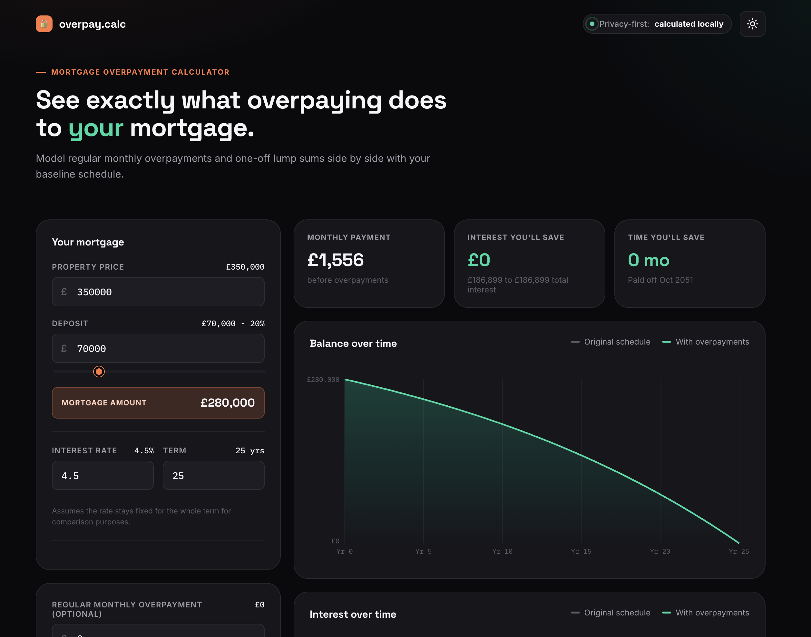

# Mortgage Calculator

An open-source mortgage calculator. See exactly what overpaying does to a loan.

GitHub Pages URL: https://amprew.github.io/mortgage-calculator/



## Scripts

- `npm install`
- `npm run dev` to run the React app
- `npm run typecheck` to check all source, stories, and configuration types
- `npm test` to run library regression tests once
- `npm run test:watch` to rerun library tests as files change
- `npm run build` to typecheck and build the package
- `npm run build:pages` to typecheck and generate GitHub Pages files in `dist/`
- `npm run storybook` to open the styleguide
- `npm run build-storybook` to export the styleguide

## Project structure

- `src/lib/mortgage.ts` amortization, formatting logic, and shared mortgage types
- `src/components/*` UI components
- `src/styles/tokens.css` design tokens for the styleguide
- `src/styles/global.css` application styling
- `.storybook/*` Storybook configuration
- `stories/App.stories.tsx` top-level styleguide story

## Notes

The package keeps all mortgage calculations in the browser and does not call external APIs.

## Tests

Vitest tests live alongside the library code in `src/lib/*.test.ts`. They cover independently calculated loan payments, interest, regular and lump-sum overpayments, input normalization, formatting, date behavior, and chart values after early payoff. The Pages workflow runs these tests before building and deploying.

## GitHub Pages Deployment

1. In `amprew/mortgage-calculator`, open **Settings > Pages** and select **GitHub Actions** as the build and deployment source.
2. To generate the static files locally, run:

	```sh
	npm ci
	npm run build:pages
	```

	The output is `dist/index.html` and `dist/assets/`. This build uses `/mortgage-calculator/` as the asset base path. The normal build and development server are unchanged.
3. Commit and push the deployment workflow, build script, and documentation to `main`. The **Deploy to GitHub Pages** workflow installs dependencies, typechecks, builds, uploads `dist/`, and deploys it. Do not commit `dist/` or create a `gh-pages` branch for this workflow.
4. Monitor the workflow in the repository's **Actions** tab. Once deployment succeeds, open <https://amprew.github.io/mortgage-calculator/>. Future pushes to `main` deploy automatically; use **Run workflow** for a manual deployment.

For a local preview of the Pages build, run `npm run preview` and open the displayed server URL with `/mortgage-calculator/` appended. If using a custom domain that serves the app at the root, change the Pages build base to `/`.
